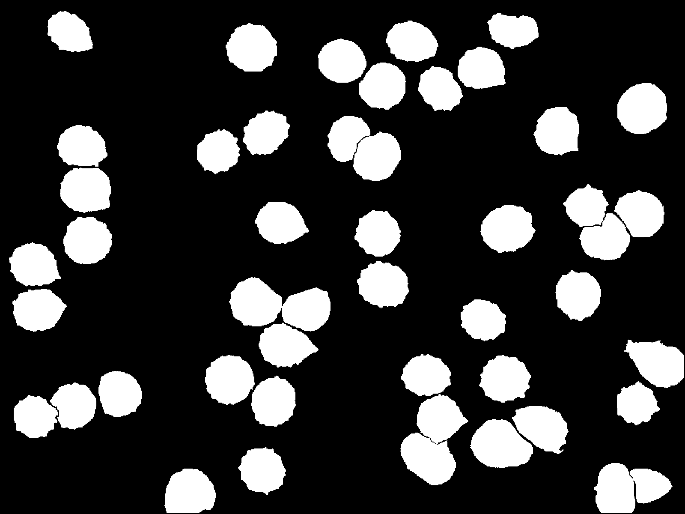
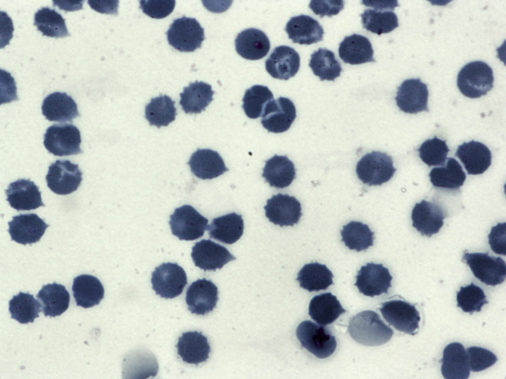

# Annotation

Dataset download link: https://drive.google.com/file/d/1nG-ra6BPAZSTsdYCvedzCo-JLD7jdH71/view?usp=share_link

**Title**
Automatic segmentation of blood cells from microscopic slides: A comparative analysis

**Abstract**

With the recent developments in deep learning, automatic cell
segmentation from images of microscopic examination slides
seems to be a solved problem as recent methods have achieved
comparable results on existing benchmark datasets. However,
most of the existing cell segmentation benchmark datasets either
contain a single cell type, few instances of the cells, not publicly available. Therefore, it is unclear whether the performance
improvements can generalize on more diverse datasets. In this
paper, we present a large and diverse cell segmentation dataset
BBBC041Seg1 which consists both of uninfected cells (i.e., red
blood cells/RBCs, leukocytes) and infected cells (i.e., gametocytes, rings, trophozoites, and schizonts). Additionally, all cell
types do not have equal instances which encourages researchers
to develop algorithms for learning from imbalanced classes in a
few shot learning paradigm. Furthermore, we conduct a comparative study using both classical rule-based and recent deep
learning state-of-the-art (SOTA) methods for automatic cell segmentation and provide them as strong baselines. We believe the
introduction of BBBC041Seg will promote future research towards clinically applicable cell segmentation methods from microscopic examinations which can be later used for downstream
tasks such as detecting hematological diseases(i.e., malaria).

**Data Sample**
 
  

**Full Code**
https://github.com/Deponker/Blood-cell-segmentation

**Paper link**

https://www.sciencedirect.com/science/article/pii/S0040816621001695?casa_token=klfAtnT0ofUAAAAA:9X1dr5MEJGTzCXTQ9bsy5ApwzBjopfAVMvgisdypbO6t5AYVSpXgDNcD607g2yIX9wx4GBAfavM

**My Google Scholar**
https://scholar.google.com/citations?user=PHg000cAAAAJ&hl=en&oi=ao

**Cite Work**

title={Automatic segmentation of blood cells from microscopic slides: a comparative analysis},
author={Depto, Deponker Sarker and Rahman, Shazidur and Hosen, Md Mekayel and Akter, Mst Shapna and Reme, Tamanna Rahman and Rahman, Aimon and Zunair, Hasib and Rahman, M Sohel and Mahdy, MRC},
journal={Tissue and Cell},
volume={73},
pages={101653},
year={2021},
publisher={Elsevier}
}

**MLA**
@article{depto2021automatic,
  title={Automatic segmentation of blood cells from microscopic slides: a comparative analysis},
  author={Depto, Deponker Sarker and Rahman, Shazidur and Hosen, Md Mekayel and Akter, Mst Shapna and Reme, Tamanna Rahman and Rahman, Aimon and Zunair, Hasib and Rahman, M Sohel and Mahdy, MRC},
  journal={Tissue and Cell},
  volume={73},
  pages={101653},
  year={2021},
  publisher={Elsevier}
}

**APA**

Depto, D. S., Rahman, S., Hosen, M. M., Akter, M. S., Reme, T. R., Rahman, A., ... & Mahdy, M. R. C. (2021). Automatic segmentation of blood cells from microscopic slides: a comparative analysis. Tissue and Cell, 73, 101653.
